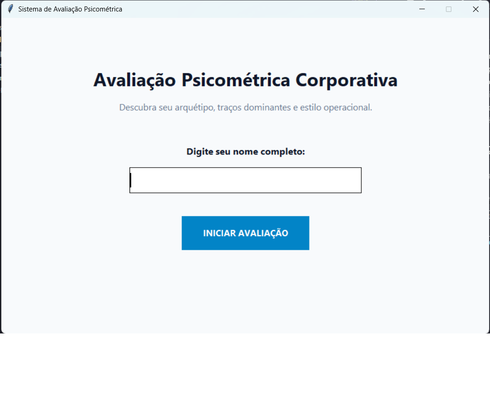
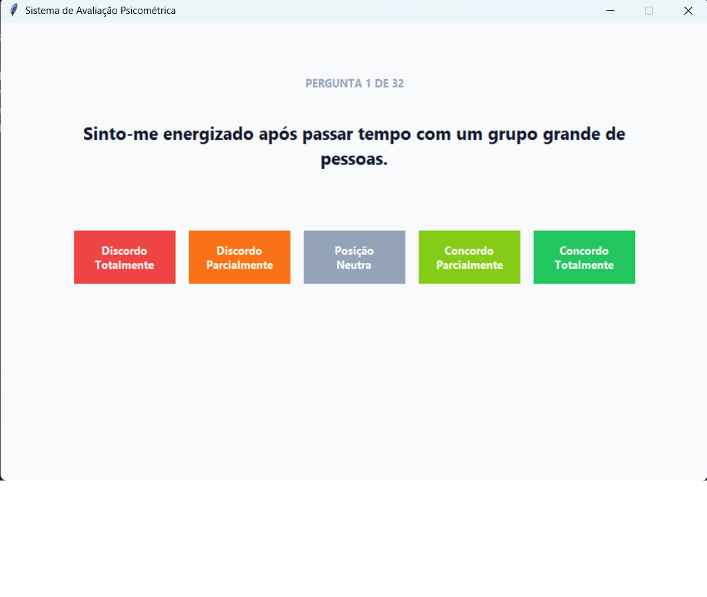
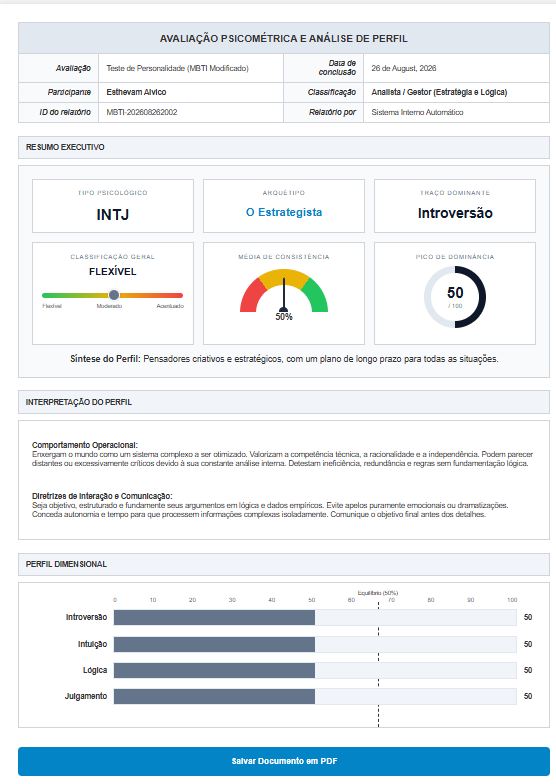

# Sistema de Avaliação Psicométrica Corporativa 🧠📊

Um aplicativo desktop interativo desenvolvido em Python para análise de perfil comportamental e personalidade (baseado na metodologia dos eixos do MBTI). O sistema aplica um questionário guiado e gera automaticamente um dashboard analítico avançado em formato HTML/PDF.

## 📸 Demonstração Visual

<!-- Substitua os caminhos abaixo pelo nome das imagens que você salvar na pasta do projeto -->






## 🚀 Funcionalidades

*   **Interface Gráfica Intuitiva:** Desenvolvida nativamente com `Tkinter`, oferecendo uma experiência fluida para o usuário fora do terminal.
*   **Questionário Escala Likert:** 32 perguntas assertivas avaliadas de 1 (Discordo Totalmente) a 5 (Concordo Totalmente) para maior precisão matemática.
*   **Análise Multidimensional:** Avalia 4 eixos cognitivos (Energia, Processamento, Decisão e Estilo de Vida) para mapear 16 perfis possíveis.
*   **Classificação Corporativa:** Enquadra o usuário em 4 macro-grupos práticos de mercado (Analista/Gestor, Diplomata/Criativo, Sentinela/Operacional, Explorador/Suporte).
*   **Geração de Relatório Dashboard:** Exporta um documento HTML estilizado com gráficos gerados puramente em CSS (Barra de Intensidade, Velocímetro de Consistência e Gráfico de Rosca), pronto para ser impresso/salvo em PDF.

## 🛠️ Tecnologias Utilizadas

*   **Python 3.x**
*   **Tkinter** (GUI padrão do Python)
*   **HTML5 & CSS3** (Layout e renderização dos gráficos do relatório)
*   **PyInstaller** (Para compilação do executável `.exe`)

## 📁 Arquitetura do Projeto

O código foi modularizado seguindo as melhores práticas de Engenharia de Software (*Separation of Concerns*), dividido em 4 arquivos principais:

*   `dados.py`: Armazena o banco de dados (perguntas e descrições dos arquétipos).
*   `motor_calculo.py`: Responsável pela lógica matemática, cruzamento de dados e definição do status.
*   `gerador_relatorio.py`: Contém o template visual HTML/CSS e a injeção dinâmica de variáveis.
*   `main.py`: Ponto de entrada da aplicação, controlando a interface gráfica (Tkinter) e a orquestração do fluxo.

## ⚙️ Como Instalar e Executar

1. Clone este repositório para sua máquina local:
   ```bash
   git clone [https://github.com/seu-usuario/nome-do-repositorio.git](https://github.com/seu-usuario/nome-do-repositorio.git)

2. Acesse a pasta do projeto:
    ```Bash
    cd nome-do-repositorio

3. O projeto não exige bibliotecas externas além da biblioteca padrão do Python. Para rodar, execute:

    ```Bash
    python main.py


## 📦 Como Compilar o Executável (.exe)
Para criar uma versão standalone do aplicativo (ideal para enviar a usuários finais sem exibir a tela de console preta do Windows), utilize o PyInstaller:

        
    pip install pyinstaller
    
    python -m PyInstaller --noconsole main.py

O aplicativo compilado estará disponível dentro da pasta dist/main/.

## 👨‍💻 Autor
Esthevam Alvico

Desenvolvedor em formação (Análise e Desenvolvimento de Sistemas)


* LinkedIn: [Esthevam Alvico](https://www.linkedin.com/in/esthevam-alvico-25518728b)
* GitHub: [@Esthevamnascimento](https://github.com/esthevamnascimento)